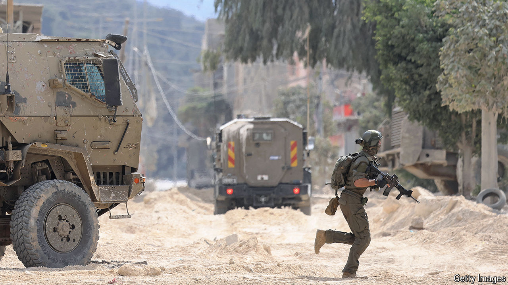

###### The world this week

# Politics 

#####  

 

> Aug 29th 2024 

 warplanes bombed dozens of  missile-launch sites in . The militia group fired at least 200 rockets towards northern Israel; most were intercepted by Israel’s Iron Dome missile-defence system. Both sides then moved to de-escalate a skirmish many feared could get out of hand. Meanwhile, Israeli troops rescued an Israeli Bedouin hostage from a tunnel in . He had been kidnapped during the Hamas attacks in October 2023. And at least ten Palestinians were killed in Israeli counter-terrorism raids in four cities in the . 

