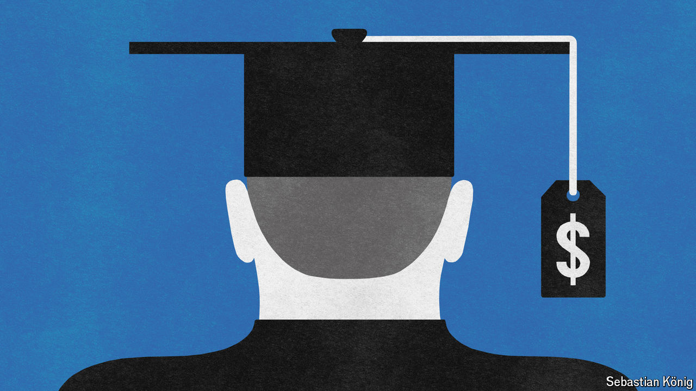

###### 180 degrees

# The education business 

##### For-profit colleges in America would have very different futures under Donald Trump or Kamala Harris 

 

> Aug 29th 2024 

Donald Trump and Kamala Harris are at odds on many policy issues, but one topic is particularly personal for both: for-profit colleges. Mr Trump once owned a for-profit college, predictably called Trump University. He agreed to pay $25m in 2016 to settle lawsuits brought by students alleging their had not taught them anything. Three years earlier, as California’s attorney-general, Ms Harris went after a different for-profit college. She sued the now-defunct Corinthian Colleges for “predatory and unlawful practices” and won $1.2bn. 

