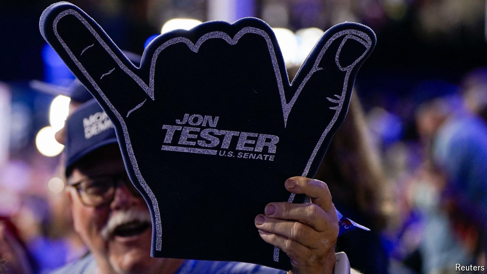

###### Campaign calculus

# To hold the Senate, Democrats have to do something extraordinary 

##### They must pull off the biggest reversal of electoral disadvantage since 1978 

 

> Aug 28th 2024 

AMID THE congratulatory messages for Kamala Harris, there has been one notable absence. Jon Tester, the longtime Democratic senator from Montana running for re-election, has declined to endorse his party’s standard-bearer. Currently down by an average of one point in the polls against his Republican opponent Tim Sheehy, a former Navy SEAL, Mr Tester told local newspapers that he did not want to nationalise his race. “This isn’t about national politics, this is about Montana,” he declared.

