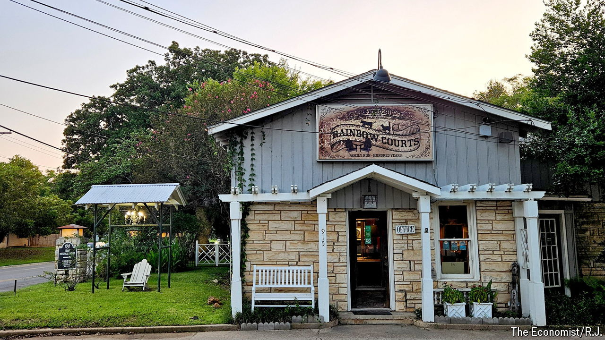

###### Over the Rainbow

# What Texas’s oldest motel reveals about the rural South 

##### From joyrides and drugs to economic dynamism 

 

> Aug 29th 2024 

IT IS RARE for crickets to drone out pickup trucks. But off a country highway, Texas’s oldest motel is anything but common. The grit of a typical roadside stop is replaced by an oasis that tells the story of a changing South. 

