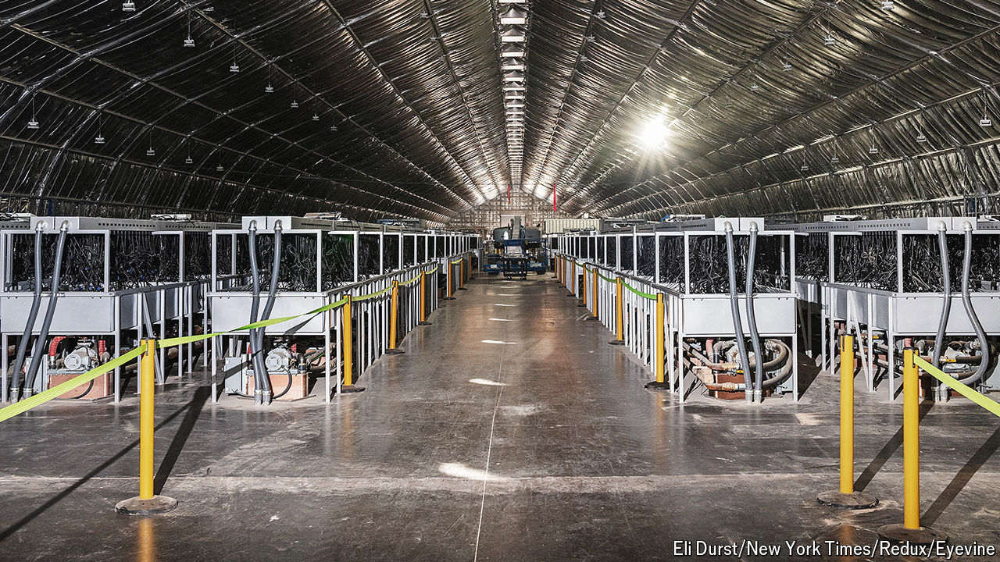

###### Power hungry

# Why Texas Republicans are souring on crypto 

##### Playing the state’s energy market has become more profitable than mining bitcoin 

 

> Aug 27th 2024 

Cryptocurrency is now campaign talk, thanks to . Last month, in their party platform, Republicans announced plans to bring an end to the “unAmerican crypto crackdown” and pledged to “defend the right to mine Bitcoin”. At a bitcoin conference in Nashville days later, the biggest such get-together in the world, Mr Trump vowed to make America the “crypto capital of the planet”. 

