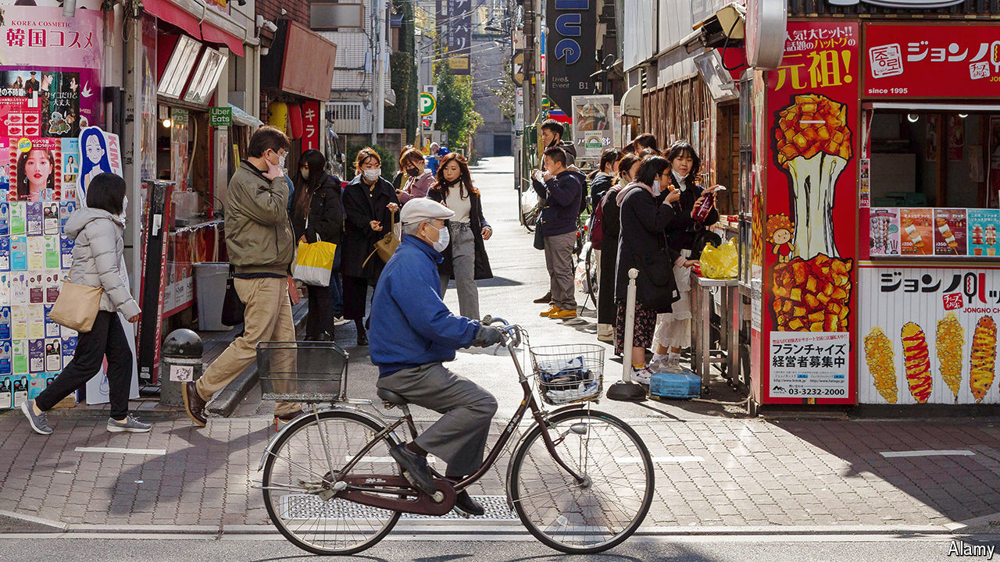

###### Is the past really past?

# Could Japan and South Korea finally become friends? 

##### Younger generations are less concerned with their country’s shared history 

 

> Sep 5th 2024 

National Liberation Day is traditionally an occasion for solemn celebration in South Korea, marking the country’s independence from its colonial overlord, Japan. Yet for many younger South Koreans, the holiday has become a day off like any other, and a chance to unwind. This year, on August 15th, scores of 20-somethings filled a pop-up bar in Seoul, the capital, for a party featuring drinks from around the world, including Japanese sake. “I know it’s Liberation Day, but we decided to do something fun together,” says Min Young-ji, a 28-year-old who was there with her 27-year-old sister, Gyoung-im. As children they raised South Korean flags with their parents during the holiday, but these days “you see fewer and fewer flagpoles”, says Gyoung-im. 

