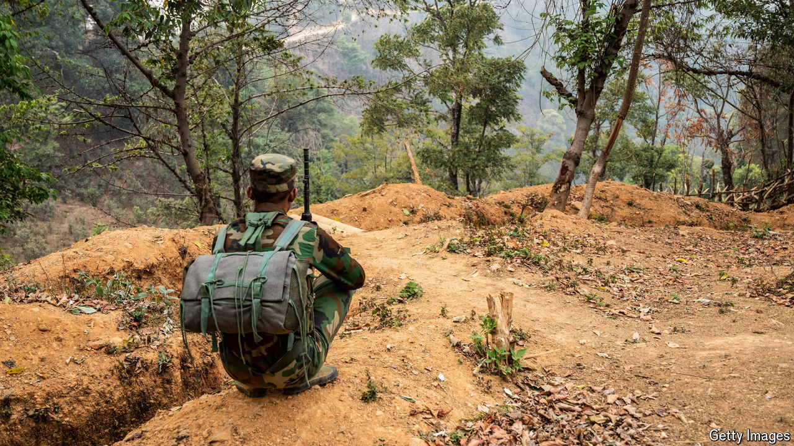

###### On the road to Mandalay

# Myanmar’s military junta is battered by Chinese-backed forces 

##### The Brotherhood Alliance continues its string of shock victories 

 

> Sep 5th 2024 

It has been many decades since war came to Mandalay, the last seat of Burmese kings. But on September 3rd a 107mm rocket cracked the pre-dawn calm, striking a residential area west of the old royal palace. A local group fighting Myanmar’s military junta claimed the attack. Its target was inside the vast palace grounds, now a military base, and home to the junta’s Central Region Command. It was the third rocket attack in Mandalay this year. 

