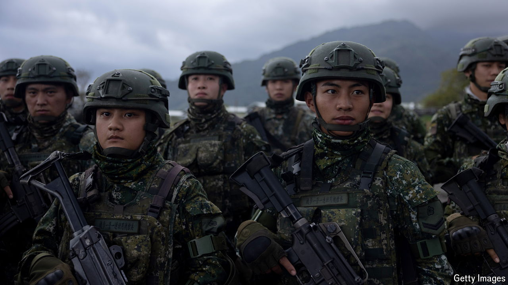

###### Amateur radio and ammo

# Taiwan is trying to learn from the wars in Gaza and Ukraine 

##### Could it repel a potential Chinese invasion? 

 

> Sep 5th 2024 

EVERY WAR is a chance for other armies to learn. The fighting in Ukraine and Israel offers lessons aplenty. Among the most avid students is Taiwan, which fears it might be the next target of attack. 

