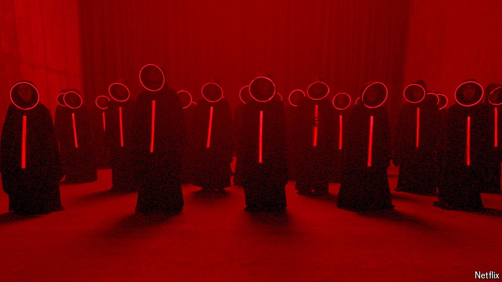

###### Scary stuff sells

# Why Indonesia’s horror films are booming 

##### Directors such as Joko Anwar are taking old ghost stories to new heights 

 

> Sep 5th 2024 

JOKO ANWAR had a bleak childhood growing up in a slum in North Sumatra in Indonesia. “I was worried I might get kidnapped by Wewe Gombel,” he says, referring to a female ghost in Javanese mythology known for abducting children. But Mr Anwar’s childhood tribulations helped him cultivate a career as a director of horror films. His breakthrough came in 2017 with “Pengabdi Setan” (“Satan’s Slaves”), about a family haunted by the death of their mother. His most recent blockbuster “Siksa Kubur” (“Grave Torture”), about two siblings whose parents are killed in a suicide-bombing, was released in April. And a recent Netflix series, “Joko Anwar’s Nightmares and Daydreams”, released in June, became the first Indonesian series to make the top ten shows in America. 

