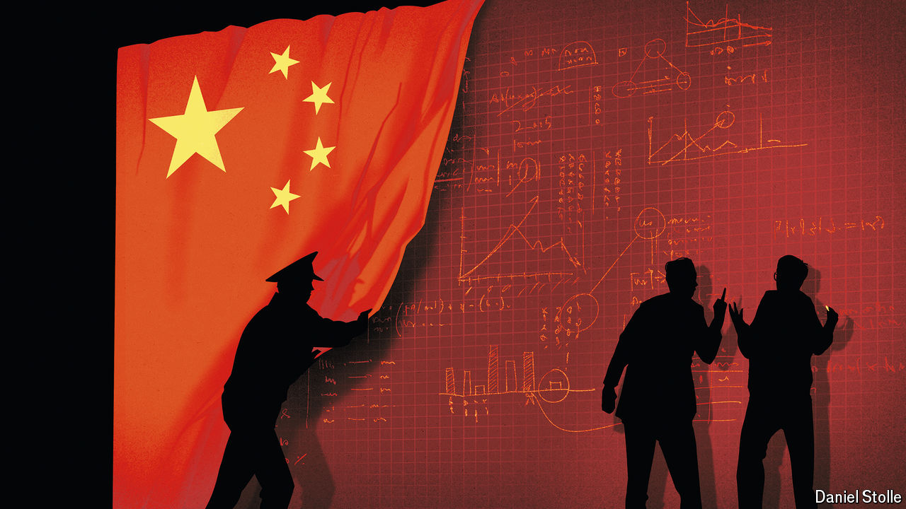

###### Lowering the veil

# The Chinese authorities are concealing the state of the economy 

##### But the Communist Party’s internal information systems may also be flawed 

 

> Sep 5th 2024 

Zhao jian’s article was online for just a few hours on August 16th before censors erased it. To Western readers the content would have appeared anodyne, but to a Communist Party official it was laced with dangerous ideas. Mr Zhao, a respected economist, argued that it was hard to grasp why China’s government was not making more effort to stimulate the economy. The most serious economic downturn in a generation had caused uncertainty about the future to “coil around the hearts of the people”, he wrote. “The logic and constraints of decision-makers cannot be understood by the market.”

