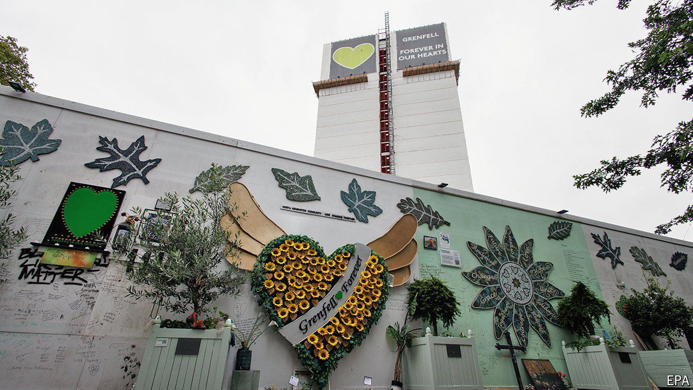

###### Public inquiries

# A tardy, scathing report on the Grenfell Tower fire in London 

##### Blaming lots of people slows things down 

 

> Sep 4th 2024 

The worst thing that can be said of a public inquiry is that it is a whitewash. Perhaps it is too narrow, too rushed or too gentle. None of which can fairly be said of Sir Martin Moore-Bick’s final report into the fire that tore through  in London in 2017, killing 72 people. The report was released on September 4th, seven years after the fire. It is almost 1,700 pages long (a preliminary report, released in 2019, was 850 pages long) and casts blame in every direction. 

