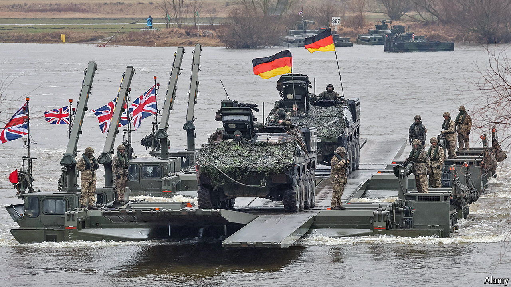

###### Hard power

# Britain and the EU find it easier to talk about guns than butter 

##### But closer ties in foreign and security policy are still not easy to forge 

 

> Sep 5th 2024 

EVEN HARD Brexiteers find it difficult to object to working with Britain’s European partners on diplomacy. It is a largely inter-governmental affair, not one involving EU institutions or the European Court of Justice (ECJ). And the case for it has become stronger given wars in Ukraine and the Middle East, a more assertive China and the risk that Donald Trump may return to the White House. EU countries also see obvious benefits from closer co-operation with a country with military clout and a tradition of foreign-policy activism. 

