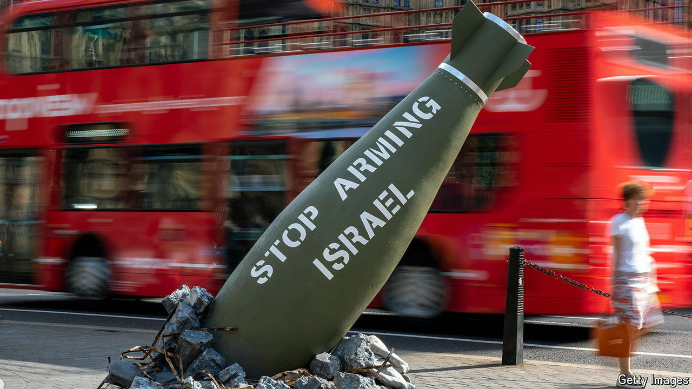

###### Labour’s Israel policy

# Britain’s ban on arms sales to Israel mixes politics and legalism 

##### The government has outlined grounds for concern but not a coherent rationale 

 

> Sep 5th 2024 

Two criticisms of Labour’s decision to ban the sale of some arms to Israel can be quickly discarded. The first is that it will seriously undermine Israel or “embolden Hamas”, as , Israel’s prime minister, claimed on September 3rd. In reality Britain accounted for just 0.02% of Israel’s defence imports in 2022, and last year sales more than halved to just £18m ($24m). The bans, which cover only 30 out of 350 export licences, were designed not to have a material impact on Israel’s security. Israel can, in any case, just get the kit from elsewhere. 

