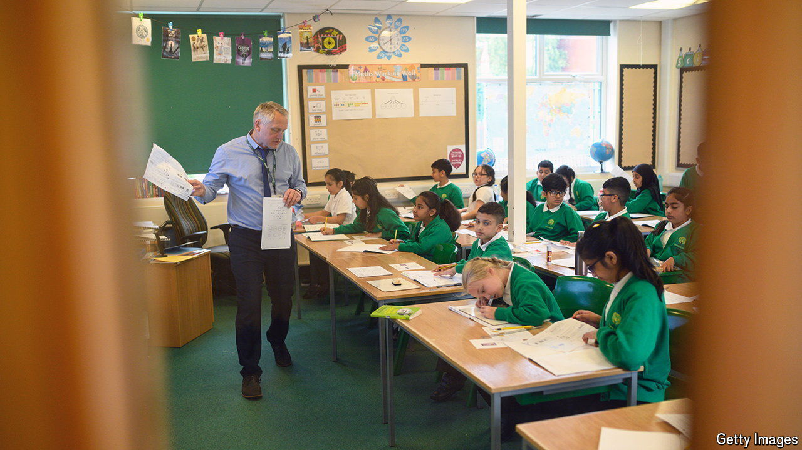

###### Roll call

# English kids are back in school. What about the teachers? 

##### The struggle to recruit and retain teaching staff 

 

> Sep 2nd 2024 

Across Britain around 10m school-aged children are returning to classrooms following the summer break. They may have no choice, but the people who teach them do. Many of them are turning away from the profession.

