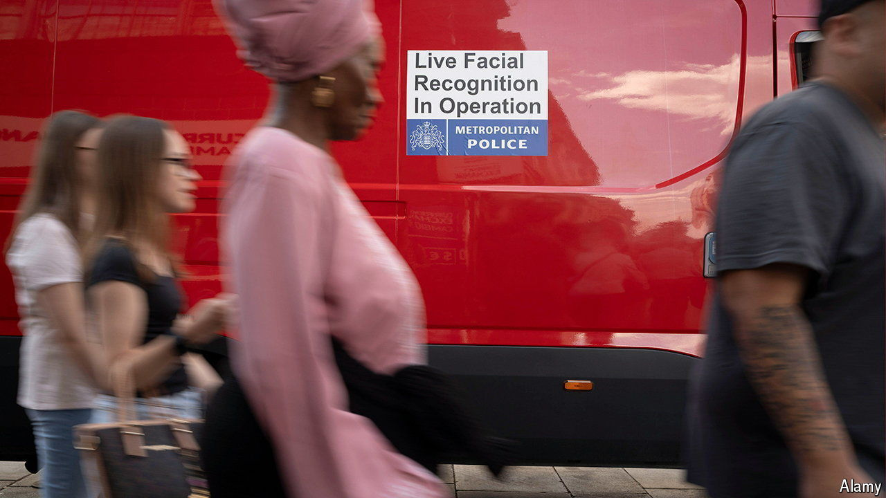

###### Facial awareness

# Police use of facial recognition in Britain is spreading 

##### The riots have given the technology a boost. Regulation is not keeping up 

 

> Sep 3rd 2024 

Britons spend large chunks of their lives on camera. The country has up to 6m closed-circuit television (CCTV) cameras—one for every 11 people in the country, the third-highest penetration rate in the world after  and . To help identify rioters in the wake of  that swept parts of the country in early August, police officers are collecting footage from mosques and shops that were vandalised. Some are releasing CCTV footage to the public to identify suspects. Others are using another technology to get the job done—facial recognition. 

