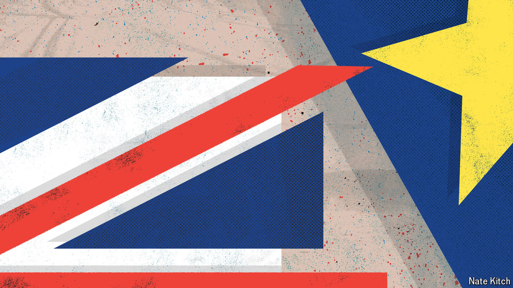

###### Time to get closer

# What’s next for Britain and the EU? 

##### Brexit’s economic toll is now clear. But the path forward is murky 

 

> Sep 5th 2024 

Few topics in British politics cause quite such a shudder as Brexit. The subject of Britain’s relationship with the European Union is polarising, jargon-ridden and, after years of upheaval, rather repetitive. No wonder it barely featured in the recent general-election campaign. But Brexit also matters greatly. The Labour Party won power in July pledging to cure the country’s economic malady. Any diagnosis of  that omits Brexit is bound to be incomplete. 

