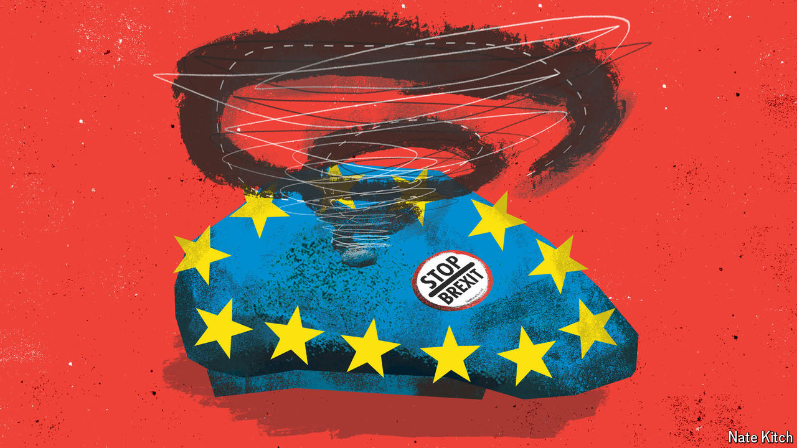

###### Bagehot

# Why are Remainers so weak in post-Brexit Britain? 

##### The European cause is hugely popular. Its proponents are strangely ineffective 

 

> Sep 4th 2024 

It first became obvious that Sir Keir Starmer wanted to be prime minister on September 25th 2018. The Labour Party was holding its annual conference in Liverpool. Theresa May’s government was slowly disintegrating over Brexit. Under Jeremy Corbyn, Sir Keir’s predecessor as party leader, Labour was keeping its position on holding a second referendum purposely opaque. From the stage Sir Keir shattered that ambiguity, departing from his approved script with the words: “And nobody is ruling out Remain as an option!” Pro-EU delegates gave him a long, defiant ovation. A year and a half later, they would elect him as their leader on a promise to “defend free movement”. Unreconciled Remainers did not stop Brexit; they did shape the Labour Party. 

