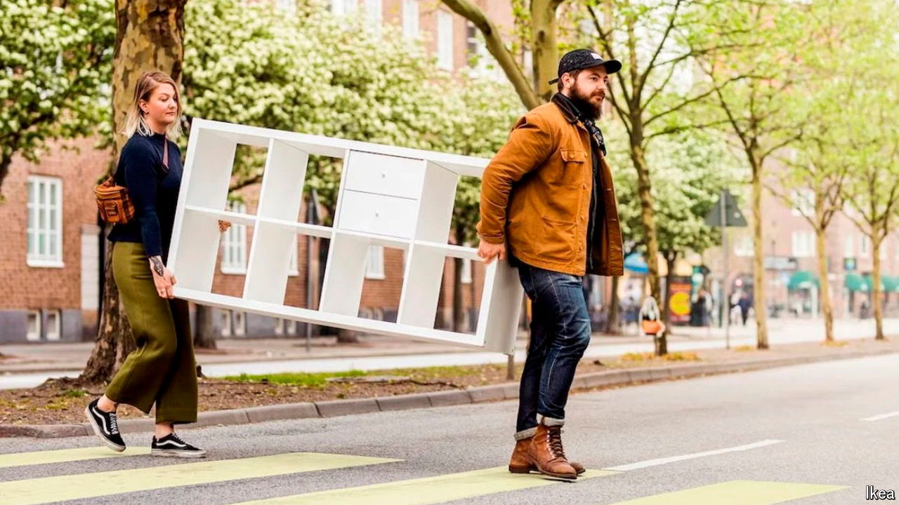

###### Flat-packing a punch

# Can IKEA disrupt the furniture business again? 

##### It wants to help you sell your Billy bookcase 

 

> Sep 5th 2024 

There are worse ways to spend a lazy Saturday than to take a trip to one of IKEA’s giant furniture stores. Young children can be swiftly deposited at , the supervised play area, leaving you to navigate the maze of flat-pack furniture and bric-a-brac at your leisure; you might even stop at the restaurant for a plate of Swedish meatballs. 

