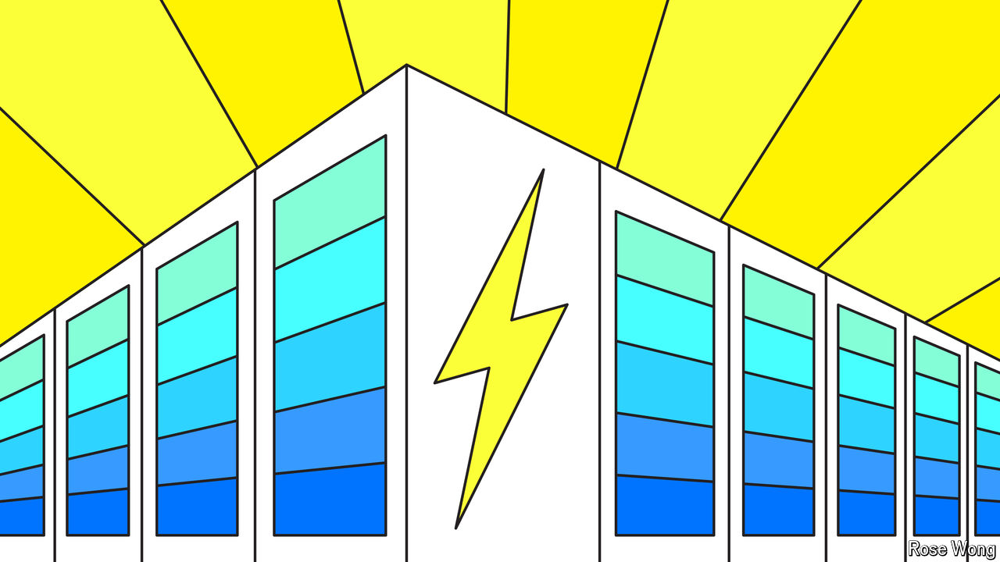

###### Charging forward

# Clean energy’s next trillion-dollar business 

##### Grid-scale batteries are taking off at last 

 

> Sep 1st 2024 

Decarbonising the world’s electricity supply will take more than solar panels and wind turbines, which rely on sunshine and a steady breeze to generate power. Grid-scale storage offers a solution to this intermittency problem, but there is too little of it about. The International Energy Agency (IEA), an official forecaster, reckons that the global installed capacity of  will need to rise from less than 200 gigawatts (GW) last year to more than a terawatt (TW) by the end of the decade, and nearly 5TW by 2050, if the world is to reach net-zero emissions (see chart 1 ). Fortunately, though, the business of storing energy on the grid is at last being turbocharged. 

