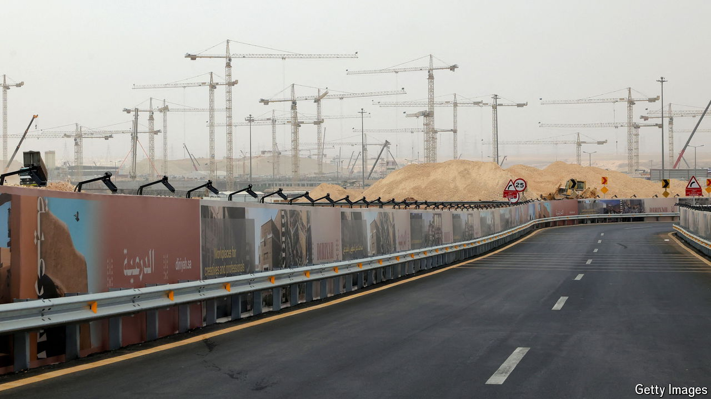

###### New Silk Roads

# Commercial ties between the Gulf and Asia are deepening 

##### It is no longer just about oil 

 

> Sep 5th 2024 

Oil has long lubricated the Gulf’s relationships abroad. That is especially so in Asia, which takes in almost three-quarters of its exports of oil and gas. Cheap energy from the Gulf has helped fuel Asia’s rise as the global centre of manufacturing, and filled the sheikhs’ coffers in return.

