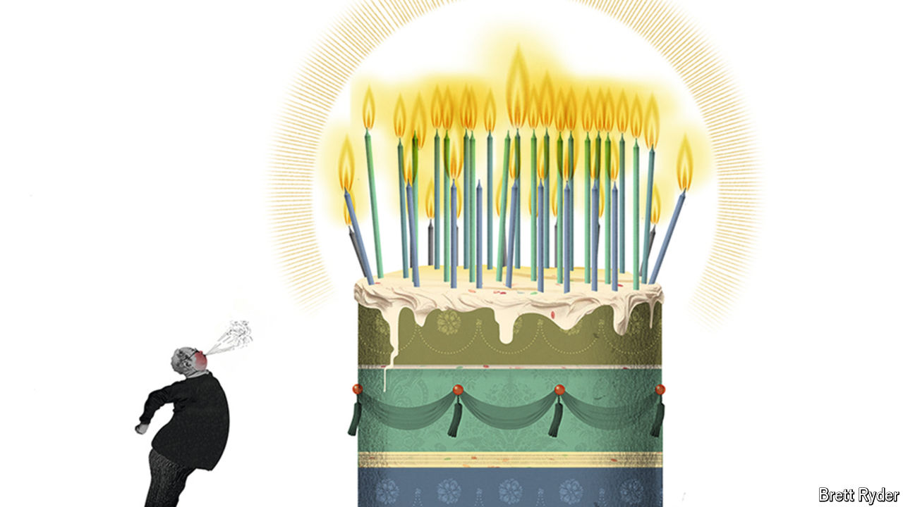

###### Schumpeter

# Has Warren Buffett lost his touch? 

##### Assessing Berkshire Hathaway’s recent performance 

 

> Sep 3rd 2024 

Warren buffett’s birthday present arrived early this year. On August 28th, two days before America Inc’s favourite great-grandpa turned 94, his bricks-to-motor-insurance conglomerate, , reached a market value of $1trn. It became only the eighth American company to claim that title and, as a child of the Nebraskan heartland, the first not to emerge from the west-coast tech scene. Its class-A shares now change hands for $715,000, 55,000 times what they were worth when Mr Buffett took control of a struggling textile mill in 1965. In that period the total return, including dividends, of the S&amp;P 500 index of America’s biggest firms has risen just 400-fold. When Berkshire’s longtime shareholders wish Mr Buffett many happy returns, his customarily folksy response might be: right back at ya.

