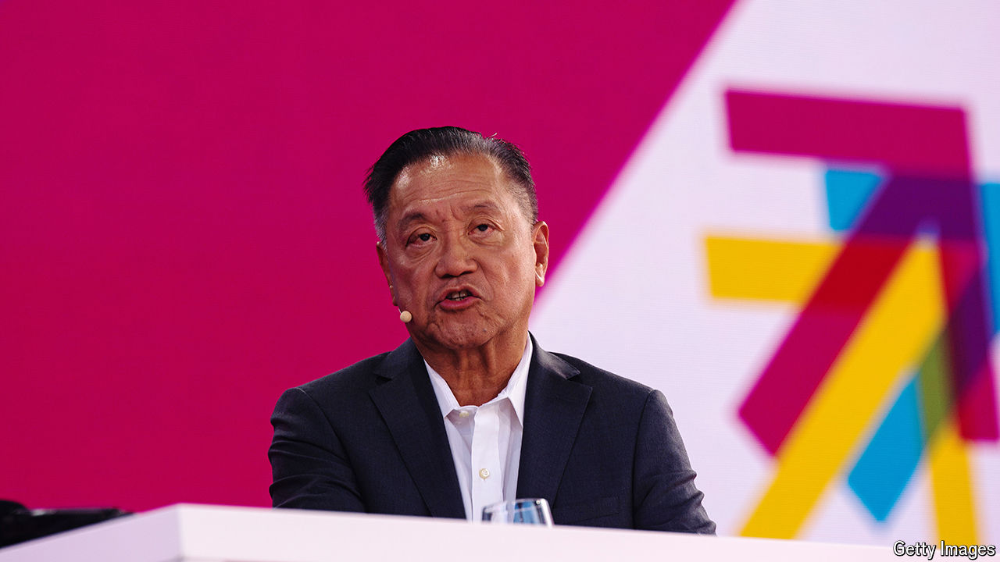

###### Broadly successful

# How Broadcom quietly became a $700bn powerhouse 

##### Its rise began well before the artificial-intelligence boom 

 

> Sep 5th 2024 

Few companies have gained as much value with as little fanfare as Broadcom has in recent years. Since the end of 2022 the American chipmaker’s market capitalisation has rocketed from around $230bn to more than $700bn. It is now the world’s 11th-most valuable company and its third-most valuable chipmaker, behind only Nvidia, the leader in artificial-intelligence (AI) semiconductors, and TSMC, the biggest manufacturer of them.

