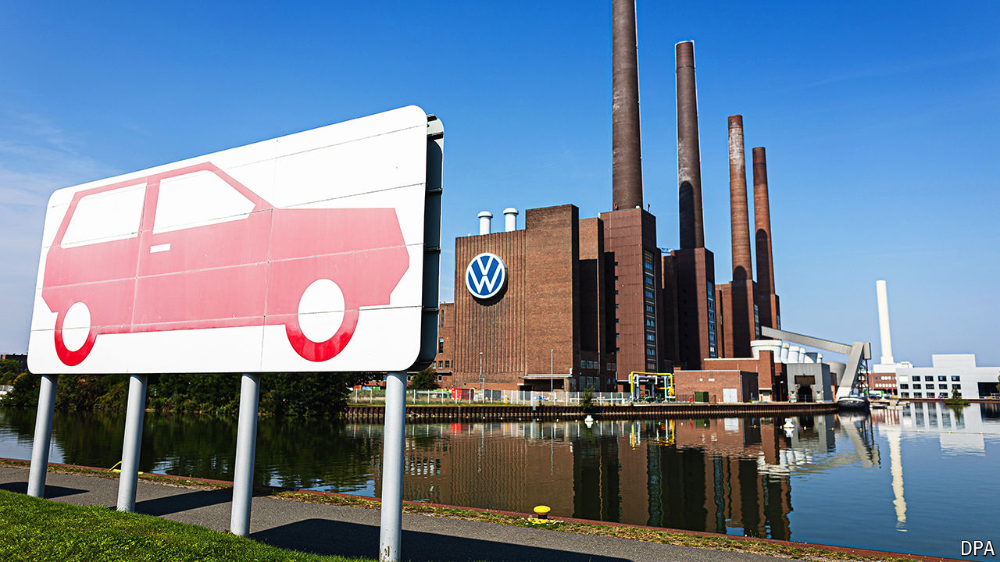

###### No quick fix

# Repairing VW requires huge upheavals 

##### Closing a few factories will help 

 

> Sep 5th 2024 

“Costs, costs, costs” are what Oliver Blume, the boss of Volkswagen (vw), recently said the car giant must address most urgently. His diagnosis of vw’s longstanding problem is nothing new, but his approach to dealing with it undoubtedly is. On September 3rd Mr Blume announced that, for the first time, vw was considering closing factories in Germany to tackle the “demanding and serious situation” confronting Europe’s carmakers. Even if he succeeds in doing so, however, shutting factories will not be sufficient to reverse VW’s dwindling sales and stay ahead of the looming onslaught of cheap Chinese electric vehicles (EVs).

