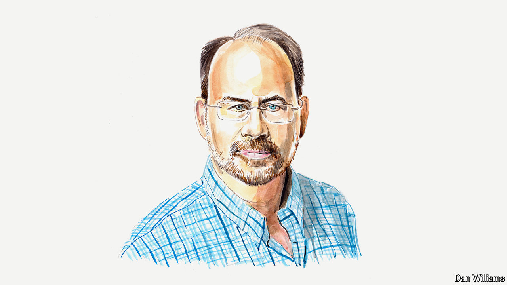

###### The American election

# Kamala Harris has good vibes. Time for some good policies 

##### Steven Teles, a political scientist, on the three Ps that the Democratic nominee should focus on 

 

> Sep 2nd 2024 

EVER SINCE Vice-President Kamala Harris seized the Democratic nomination from the shaky hands of President Joe Biden, all the talk of her candidacy has focused on the V-word: vibes. Her campaign has emphasised joy and patriotism, in sharp contrast to the DC-Universe darkness of Donald Trump and his running-mate, J.D. Vance.

