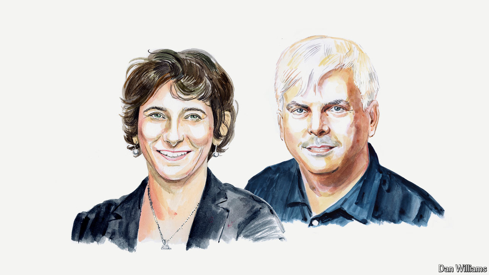

###### Artificial intelligence and society

# Large language models will upend human rituals 

##### The results could be disturbing, argue Marion Fourcade and Henry Farrell 

 

> Sep 4th 2024 

ARTHUR C. CLARKE wrote a story in which the entire universe was created so that monks could ritually write out the nine billion names of God. The monks buy a computer to do this faster and better, with unfortunate consequences for the rest of us. The story’s last sentence: “Overhead, without any fuss, the stars were going out.”

