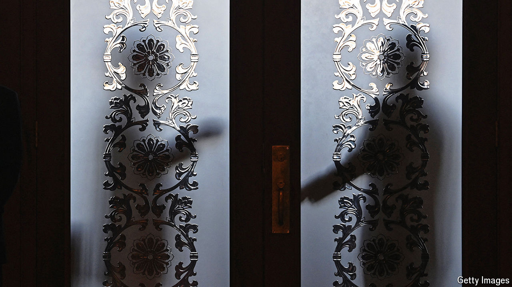

###### Not for the religious or lazy

# How to get kicked out of China’s Communist Party 

##### Officials are trying to expel slackers and the superstitious 

 

> Sep 5th 2024 

China’s Communist Party has over 99m members. So it is no surprise that some are not up to scratch. The corrupt, criminal or disloyal are handled by the party’s fearsome internal-investigation arm, the Central Commission for Discipline Inspection. It has punished thousands of officials in recent years. But that still leaves another kind of troublesome member: those who have not broken any laws, but just aren’t very good communists.

