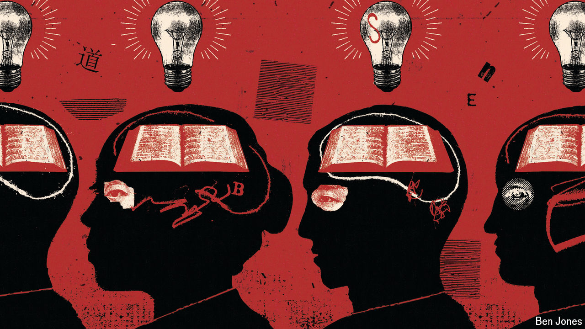

###### Yearning to think freely

# Liberalism is far from dead in China 

##### Despite an intense clampdown, it may even be drawing more adherents 

 

> Sep 5th 2024 

Walk into the All Sages Bookstore in north-western Beijing, and you enter a different world. Not here the collections of speeches by China’s leader, Xi Jinping, that greet visitors to state-owned bookshops—rows of covers with the same face, the same beneficent smile. The founder of All Sages, Liu Suli, served 20 months in prison for his role in the Tiananmen Square protests of 1989. His shelves are filled with the works of free thinkers: economists and political scientists, historians and legal scholars. The potential market could be bigger than it was during the build-up to Tiananmen. Mr Liu says China’s liberals are becoming ever more numerous. 

