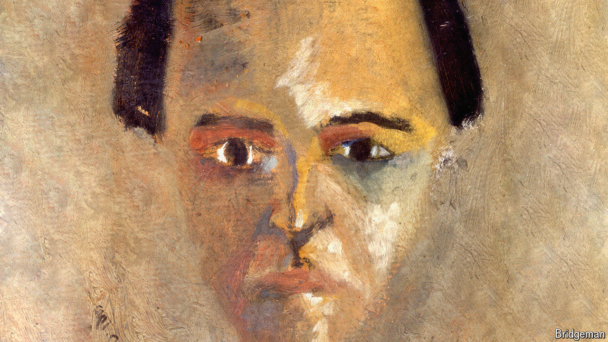

###### A maestro, due an encore

# Arnold Schoenberg was one of classical music’s most important rebels 

##### But, 150 years after his birth, he is underappreciated 

 

> Sep 5th 2024 

“WERE I A gambling man,”  said in 1966, “I would be very inclined to place my money on the prospects for immortality of Arnold Schoenberg above and beyond any other composer who’s lived in our era.” Gould, a Canadian pianist, was not expressing an outlandish opinion. Schoenberg, who was born 150 years ago, on September 13th 1874, revolutionised Western music. By the middle of the 20th century his music was probably more influential than that of any other composer. Aaron Copland, an American composer, felt that all contemporary music “owes something to his daring”. 

