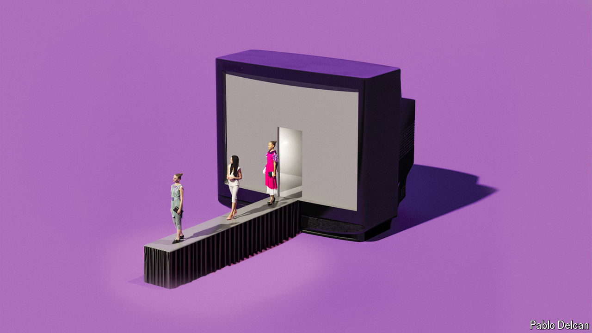

###### The devil watches Prada

# How fashion conquered television 

##### More and more shows celebrate fancy clothes. Often brands call the shots 

 

> Aug 30th 2024 

From Tokyo to Seoul, on to New York, London, Milan and Paris, there are more “fashion weeks” in September than there are weeks in the month. Models parade down  in whimsical creations that people may marvel at in years to come—or not. Recently, haute couture has also been starring in some of television’s most viewed and talked-about shows.

