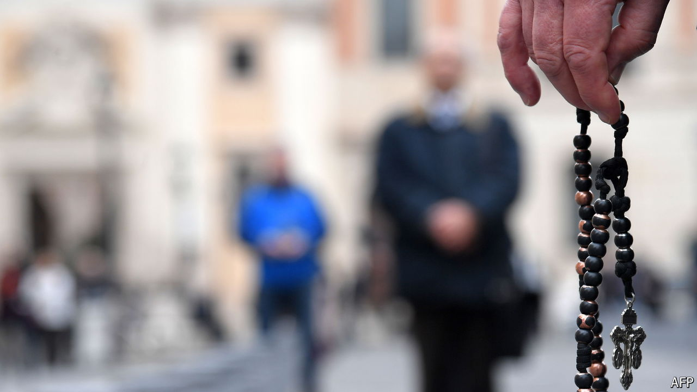

###### No more blind eyes

# Abuse by priests in Italy can no longer be tolerated by the Vatican 

##### Pope Francis is being urged to crack down harder than in the past 

 

> Sep 5th 2024 

The accusations that led to the arrest of Father Andrea Melis on August 2nd were that he befriended a 12-year-old altar boy and abused him sexually for more than three years. Father Melis, headmaster of a nursery and primary school, was alleged to have given the boy gifts and more than €5,000 ($5,530). When police searched the 60-year-old priest’s home in Genoa, they reportedly found sex toys and pharmaceutical stimulants.

