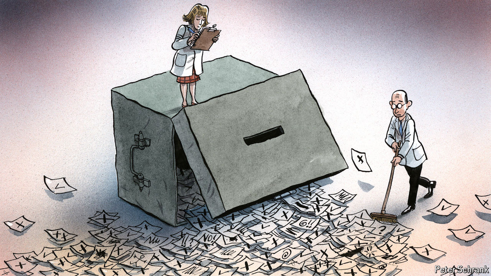

###### Charlemagne

# Europe must beware the temptations of technocracy 

##### Experts are increasingly crowding out flailing politicians 

 

> Sep 5th 2024 

Look at the state of European politics today and a collage of pandemonium emerges. France has been stuck with a caretaker government for two months following legislative elections which no party won decisively. In Germany the hard right came top in one set of state elections on September 1st; its federal chancellor, Olaf Scholz, seems destined for defeat in a nationwide ballot this time next year. The less said about Hungary and its strongman prime minister, Viktor Orban, the better. Coalitions formed by parties with little in common keep governments with tenuous majorities in power, from Spain to the Netherlands. And then there is Belgium, a country where politicians ritually haggle for a year or more before forming a government (current count: 88 days). Part of the charm of democracy is that it is messy, but Europe has elevated the chaos to high art. 

