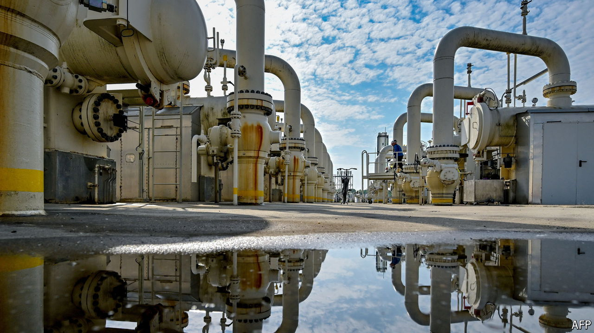

###### The awkward gas pipe

# The West still needs Russian gas that comes through Ukraine 

##### Austria, Hungary and Slovakia are particularly dependent on it 

 

> Sep 5th 2024 

When Ukrainian forces stormed into Russia early in August, Europe’s energy markets took fright. Russia’s gas exports to the EU are a fraction of what they once were. Still, news that Ukraine had captured Sudzha—a town in Russia that hosts its last major terminal for exporting the fuel to Europe via Ukraine—was enough to send the continent’s benchmark gas price to its highest level this year.

