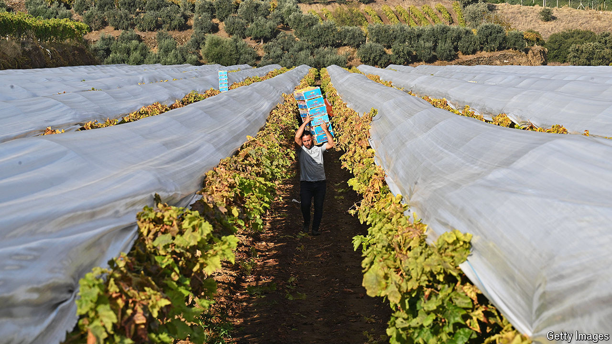

###### Succulent grapes, sometimes sour

# The obstacles faced by Turkey’s winemakers 

##### Climate and politicians can hurt the vineyards 

 

> Sep 5th 2024 

In his time off, Umay Ceviker, an architect, goes hunting for ancient vines around his native Turkey. He has found them on mountaintops, forgotten among fruit trees, and tended in fields in every nook of the country. Each year he produces 10,000 bottles made from the indigenous varieties he has discovered, selling them to wine bars and boutique stores under seven different labels of his Yaban Kolektif brand.

