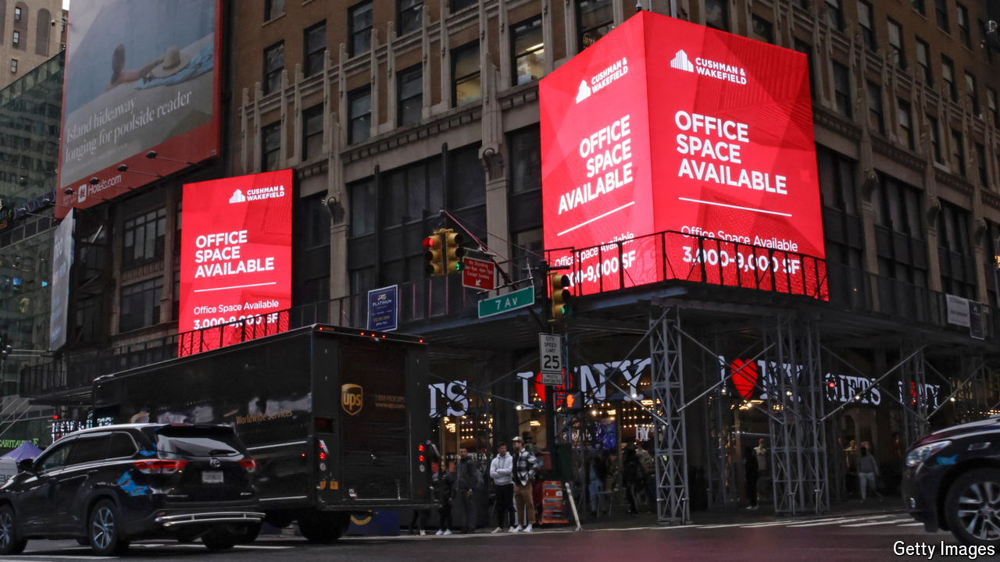

###### Long time coming

# American office delinquencies are shooting up 

##### How worried should investors be? 

 

> Sep 5th 2024 

American offices often break records. Tech firms mark their progress with ever more outlandish designs. Manhattan blocks vie to be the tallest. This year, though, a worse kind of record has been broken. Offices have hit a 20.1% vacancy rate, according to Moody’s, which is the highest since 1979, when the rating agency began to keep track.

