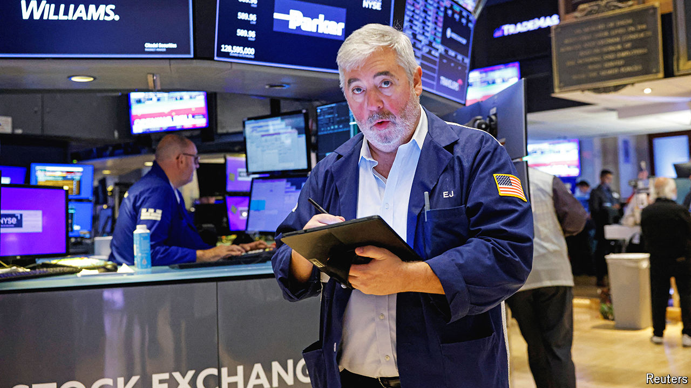

###### The leaves are turning

# As stock prices fall, investors prepare for an autumn chill 

##### Markets are in a very different place from earlier in the year 

 

> Sep 4th 2024 

Investors returning from summer holidays might feel dispirited upon checking their portfolios. Stocks have had a poor start to September. America’s S&amp;P 500 index dropped by 2% on its first day of trading. European shares followed suit on September 4th and those in Japan have fallen by even more. It is a striking change from the calm that had settled over markets before Labour Day. American share prices ended August less than a hundredth of a percentage point below an , European ones fared similarly and Japanese stocks were just a few percentage points below their peak. Adding to the good vibes, rich-world inflation had continued to cool, setting the scene for the Federal Reserve to begin cutting interest rates when its policymakers next meet on September 17th and 18th.

