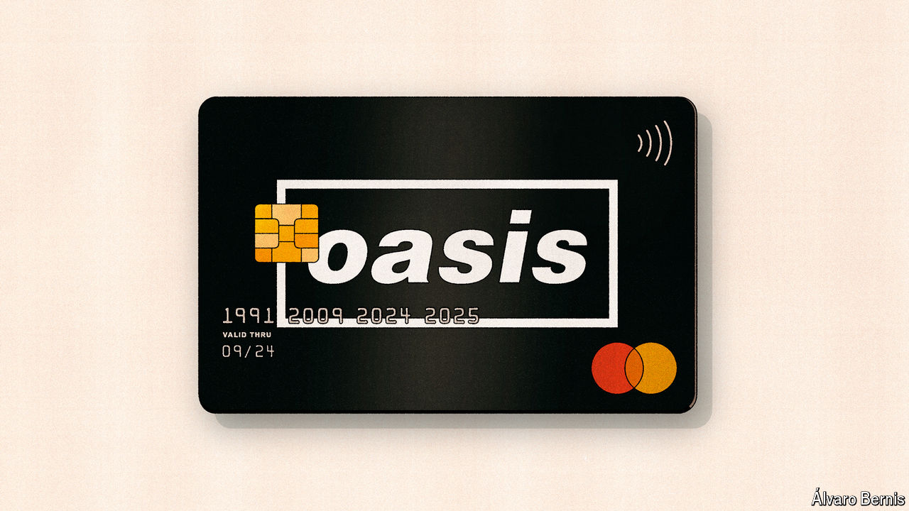

###### Free exchange

# Why Oasis fans should welcome price gouging 

##### There are worse things in life than paying a fair price 

 

> Sep 5th 2024 

The hotly anticipated comeback of a 1990s British legend sold out fast. Fans took to social media to complain. “Poor effort and a load of hype,” wrote one. “What a shitshow,” added another. “Anyone else loving the chaos?” asked an amused onlooker. To celebrate its 30th birthday, St. John, a restaurant that pioneered modern British cooking, brought back its menu from 1994, along with prices from 1994. As punters rushed to take advantage, tables were booked up in seconds—leaving most empty-handed.

