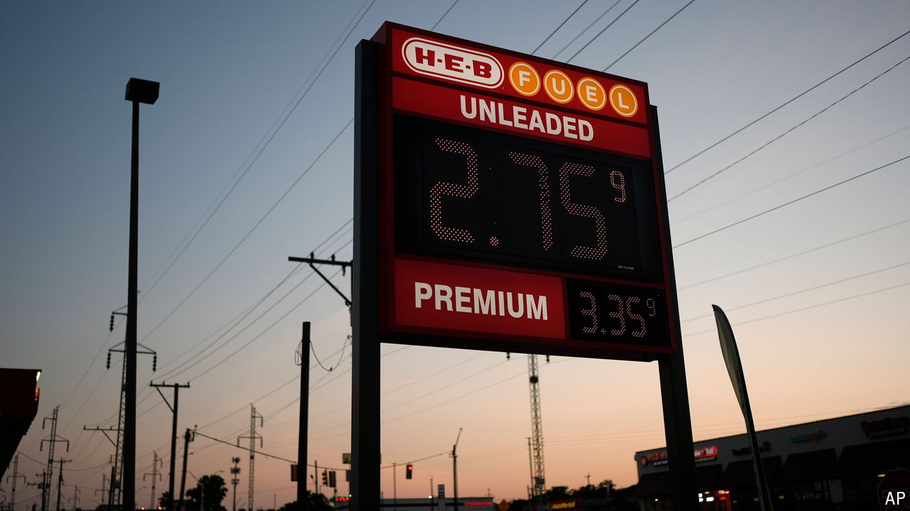

###### Golden moment

# Will interest-rate cuts turbocharge oil prices? 

##### As policymakers prepare to ease policy, traders (and presidential candidates) hold their breath 

 

> Sep 2nd 2024 

When commodity prices move in tandem, it is usually because real-world events jolt markets. China is the world’s biggest consumer of raw materials, so its economic leaps and stumbles matter. Russia’s invasion of Ukraine hindered the trade of fuels and grains, causing prices to surge. But every once in a while it is news in the financial sphere that prompts traders to act. And the most common source of such news is . 

