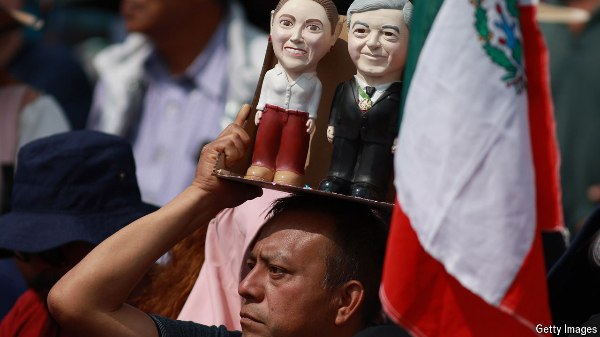

###### Constitutional chaos

# A make-or-break moment for Mexico 

##### In America’s biggest trading partner the rule of law and democracy are under attack 

 

> Sep 5th 2024 

ELECTED in 2018, President Andrés Manuel López Obrador set out to remake Mexico. But the past six years will pale next to the coming four weeks. The country held presidential and parliamentary elections in June which the ruling coalition won by a landslide, in effect giving it a supermajority in Congress. It was clear back then that Mr López Obrador would try to use this supermajority to ram through a series of  in the month during which his presidency overlaps with the new Congress. As warned at the time, it was also clear that many of these changes would profoundly damage Mexico’s democracy and economy. 

