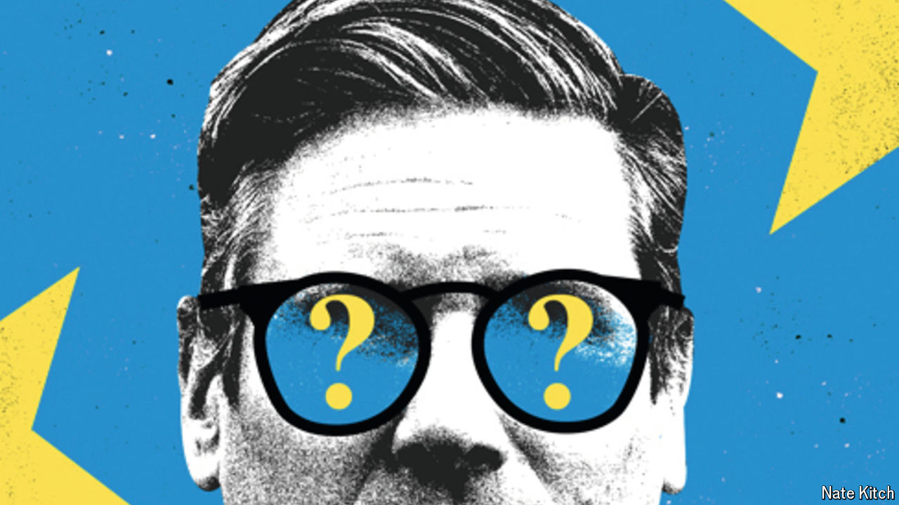

###### Red lines

# The Labour government’s worrying lack of ambition in Europe 

##### Sir Keir Starmer is trapped by the mindset of the post-Brexit years 

 

> Sep 5th 2024 

Sir Keir Starmer, Britain’s prime minister, says that he has a “once-in-a-generation opportunity” to turn the corner on Brexit. He is right. He was propelled to power in July by a largely . The leading lights of the Brexit era—Boris Johnson, Michael Gove, Sir Jacob Rees-Mogg—are figures of the past. And Britons themselves show plenty of signs of regret for the decision made in 2016. A clear majority of them now consider it a mistake.

