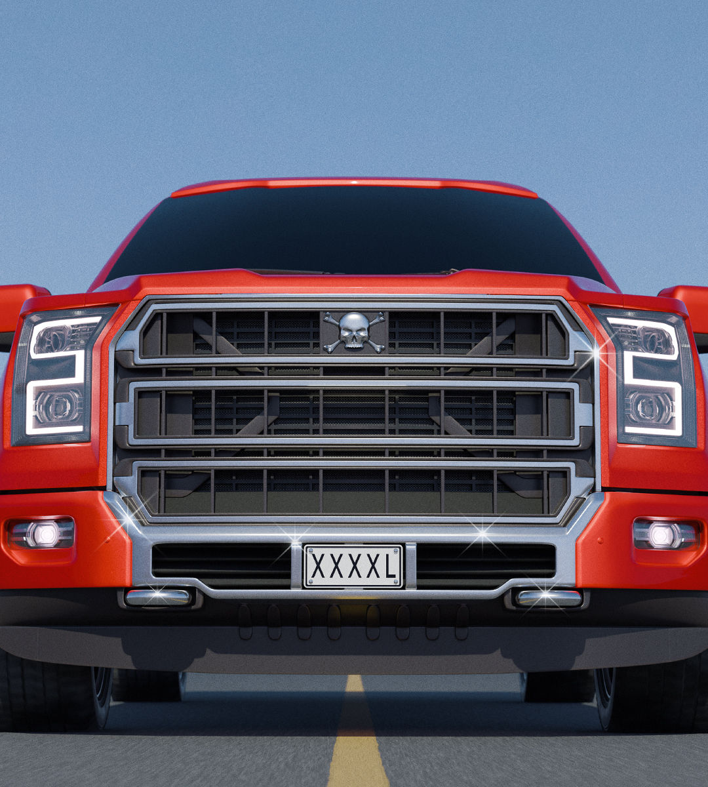

###### Monster vehicles

# What to do about America’s killer cars 

##### The country’s roads are nearly twice as dangerous as the rich-world average. It doesn’t have to be that way 

 

> Sep 5th 2024 

THE NEXT time you are stuck in traffic, look around you. Not at the cars, but the passengers. If you are in America, the chances are that one in 75 of them will be killed by a car—most of those by someone else’s car. Wherever you may be, the folk cocooned in a giant SUV or pickup truck are likelier to survive a collision with another vehicle. But the weight of their machines has a cost, because it makes the roads more dangerous for everyone else.  has found that, for every life the heaviest 1% of SUVs or trucks saves in America, more than a dozen lives are lost in smaller vehicles. This makes traffic jams an ethics class on wheels. 

