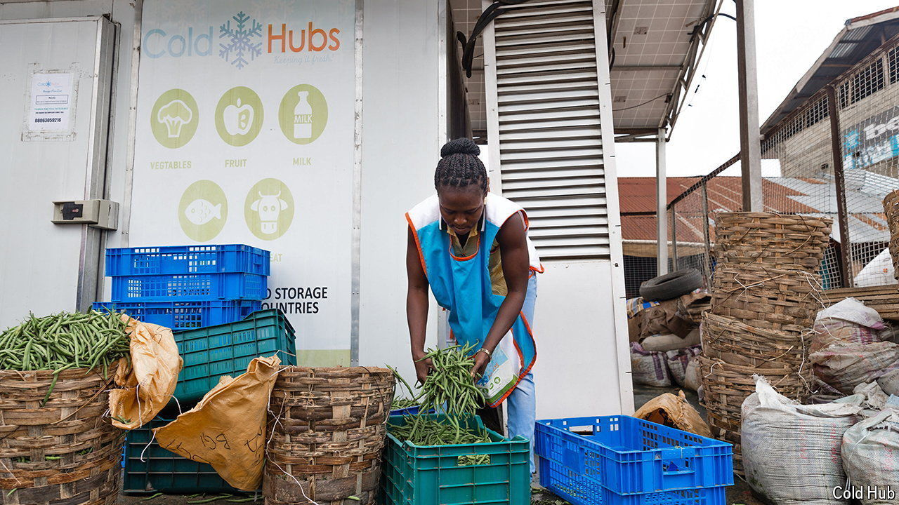

###### Chilling prospects

# How Africans can stay cool as the climate warms 

##### Air-conditioning is only part of the answer 

 

> Sep 5th 2024 

FEW PLACES on Earth are more familiar with the deadly consequences of extreme heat than countries in Africa. Heat kills crops, spoils food and medicines, and makes it impossible to work, study or sleep. As the planet warms, the number of days when people on the continent will be exposed to excessively high temperatures is set to rise. How will they keep themselves, their food and their medicines cool?

