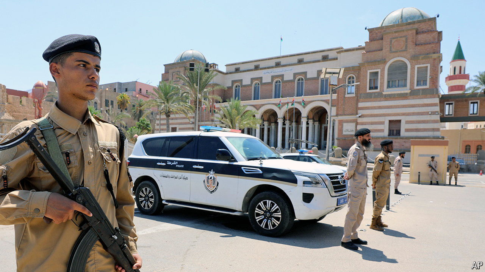

###### Shoving a central banker aside

# The fall of Libya’s central banker triggers a new struggle 

##### It could help the warlord who controls the country’s east 

 

> Sep 5th 2024 

Amid the chaos of Libya’s long-sputtering civil war, the central bank in Tripoli, the capital, has stood strong. Its red-and-white striped façade, crowned with two turquoise cupolas, a throwback to the days of Italian colonisation, were unscathed. Sadiq al-Kabir, the bank’s governor appointed after Muammar Qaddafi was toppled in 2011, survived two civil wars and six prime ministers. Libya has had two governments, parliaments, judiciaries and security regimes, but Mr Kabir, a mild-mannered bureaucrat, kept a vestige of unity, overseeing and distributing a single currency from his charming seaside bank.

