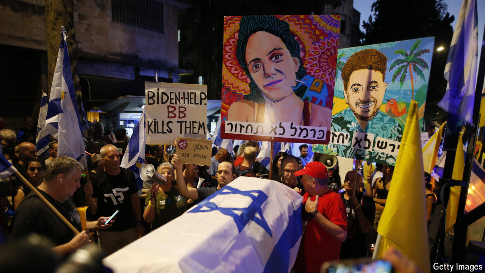

###### Israel’s hostages

# The one thing Israelis agree on: rescuing the hostages 

##### Bibi’s failure to do so has prompted huge protests 

 

> Sep 4th 2024 

The news on September 1st that the bodies of six hostages had been repatriated from Gaza prompted the largest protests across Israel since the war began on October 7th. The fate of 250 hostages whom Hamas captured that day has remained throughout the conflict the issue most likely to bring Israelis out onto the streets in protest against their government. Even the country’s trade-union federation, which usually stays out of politics, called for a general strike.

