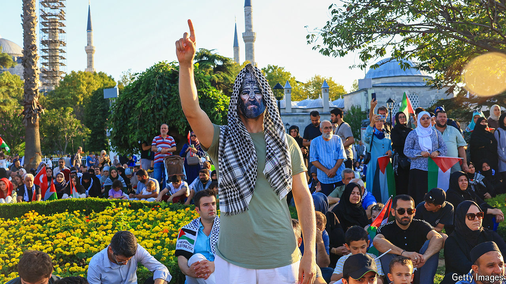

###### Israel and Turkey’s war of words

# The relationship between Israel and Turkey is at breaking point 

##### But the Turkish president is desperate to avoid a regional war 

 

> Sep 5th 2024 

Turkish flags flew at half-mast on August 2nd, to the bemusement of many Turks. No Turkish grandee had died. The reason was the assassination, orchestrated by Israel, of Ismail Haniyeh, the political leader of Hamas, in next-door Iran. Turkey’s president, Recep Tayyip Erdogan, had reacted to the killing by declaring a day of national mourning. The same day, Turkey blocked access to Instagram, accusing the social-media platform of taking down posts in memory of Haniyeh.

