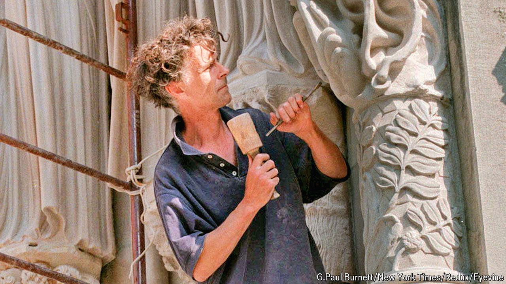

###### How to mend a cathedral

# Simon Verity believed in working the medieval way 

##### The stonemason and grotto-builder died on August 11th, aged 79 

 

> Sep 4th 2024 

The first thing you noticed about Simon Verity was his hair. It stuck out in wild grey corkscrews, as if sprayed with the fiercest sort of gel. That grey was not a sign of age, or only partly. It was mostly stone-dust, accumulated until he could never wash it out. That same dust covered the rest of his comfortably trampish clothes. When he walked down the street, he liked to think, he looked like an apparition. 

