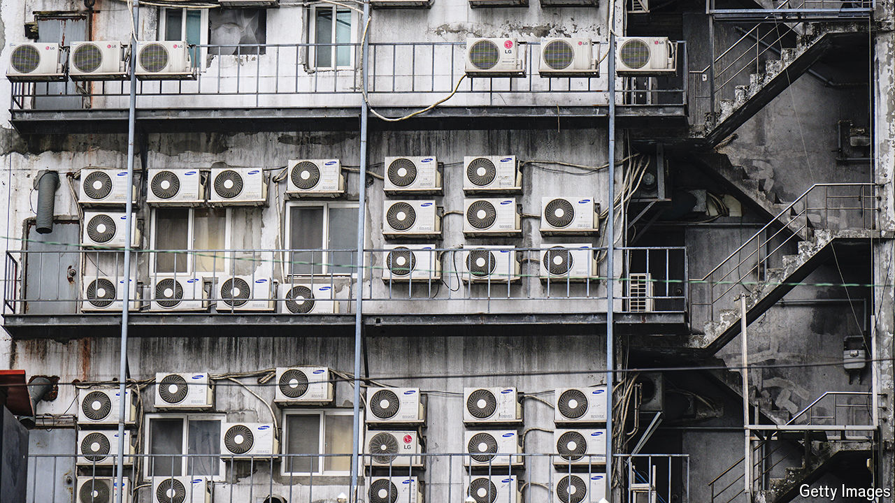

###### Cold comfort

# New tech can make air conditioning less harmful to the planet 

##### The key is energy efficiency 

 

> Sep 4th 2024 

In many parts of the world, the cool blast of an air-conditioner on a hot day is nowadays seen as a luxury rather than a necessity. Climate change is tipping the balance. Average global temperatures are now roughly 1.2°C higher than they were before the Industrial Revolution: by mid-century they are projected to be about 2°C higher. Air-conditioning (AC) use, correspondingly, is set to soar. By one estimate, the number of room-cooling ACs could nearly triple between now and 2050.

