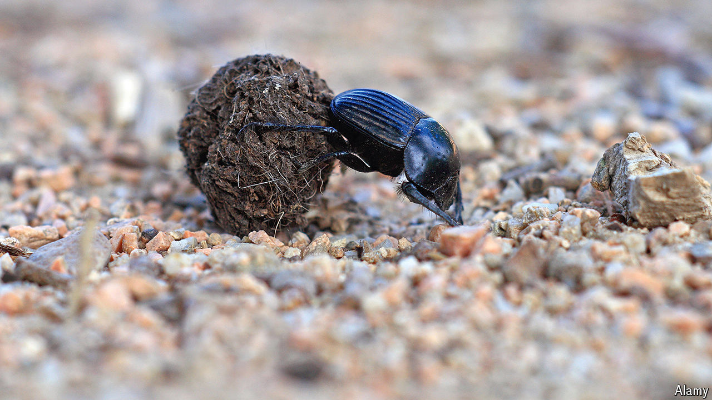

###### Waste management

# The noisome economics of dung beetles 

##### They are worth millions a year to cattle ranchers 

 

> Sep 2nd 2024 

THE ENGLISH colonists who brought cattle to Australia in 1788 soon faced a malodorous problem. The dung heaps that gradually and tastefully vanished back home were not going anywhere. Instead, they were growing ever-larger, and becoming infested with bloodsucking flies that wounded the livestock.

