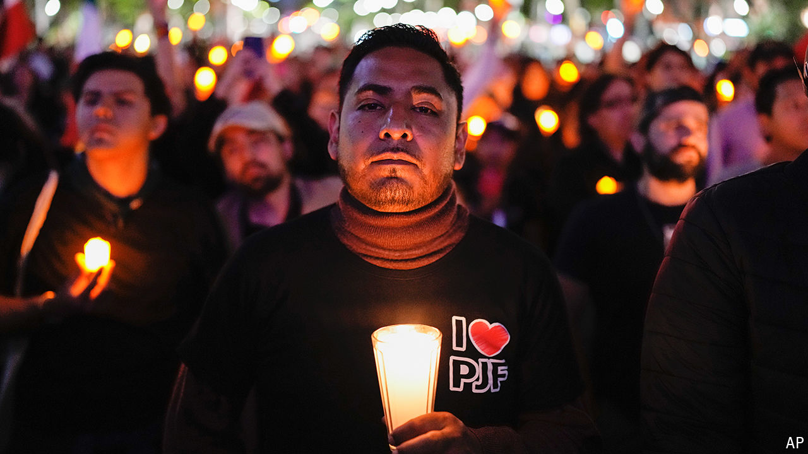

###### Mexican politics

# Claudia Sheinbaum will inherit a poisoned chalice in Mexico 

##### Her predecessor’s last act is a dangerous overhaul of the constitution 

 

> Sep 5th 2024 

A boisterous emerging economy with 126m people, a 3,140km-long border with the United States and powerful criminal gangs were always going to mean a full in-tray for Claudia Sheinbaum, Mexico’s first female president, who will be sworn in on October 1st. But President Andrés Manuel López Obrador, her mentor, is making it yet more daunting. In his last month in power he is pushing through a slew of constitutional changes that will profoundly reshape Mexico for the worse.

