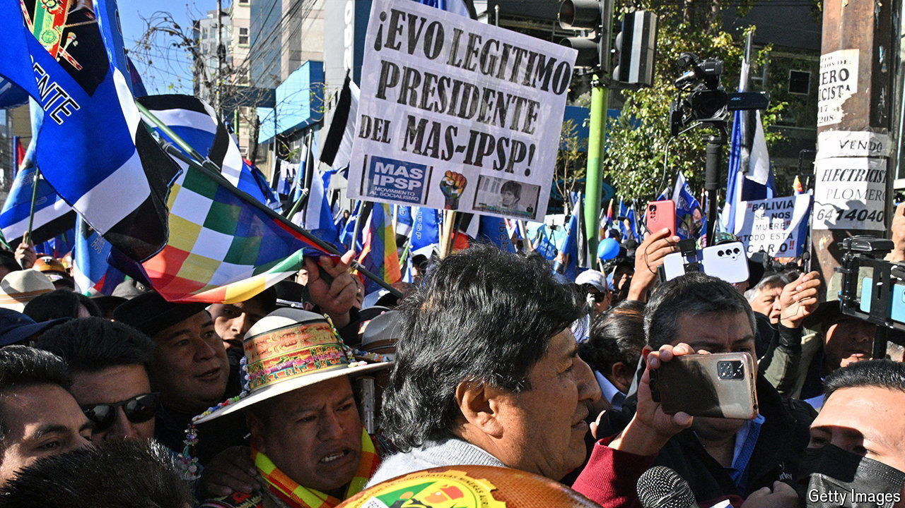

###### Hamstringing justice

# Electing top judges has been a disaster in Bolivia 

##### The fight over the courts has poisoned politics 

 

> Sep 5th 2024 

By some counts, Bolivia has seen two coup attempts in the past year. Everyone saw the failed one in June, when a disgruntled general smashed an armoured personnel-carrier through the doors of the historic seat of government, before being arrested. But some in the opposition claim there was another, late last year, when the Constitutional Court suddenly interfered to hand sitting judges more power.

