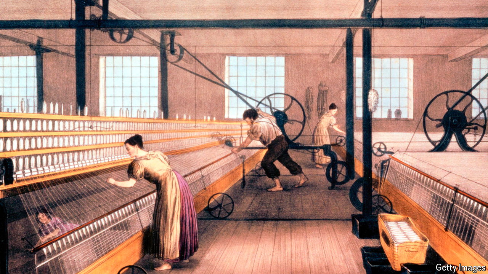

###### The Economist reads

# What to read about the British economy 

##### Britain used to be the world’s richest country. These six books explain how it came to be, and why it is no longer 

 

> Sep 3rd 2024 

IN RECENT YEARS the British economy has tended to be in the news for the wrong reasons. Growth has been soggy, inflation has been high and living standards have been squeezed. Over the past 15 years productivity growth has stalled and income per person has declined relative to that in many other developed countries. Brexit is one reason. Another is poor policy choices that the government made in response to the financial crisis of 2008-09. The Labour government, elected in July 2024, has made reviving economic growth its top priority. 

